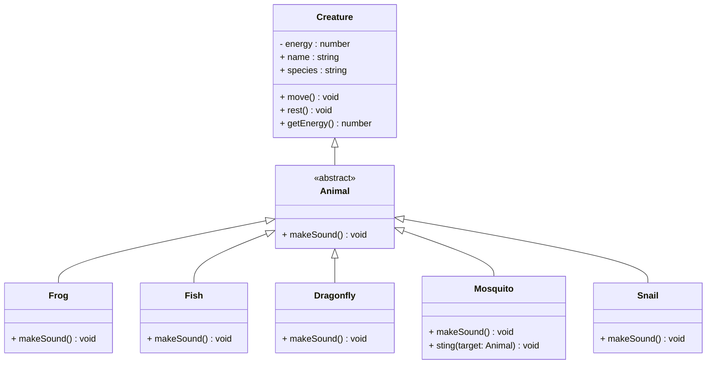

```mermaid
classDiagram

class Creature {
  - energy : number
  + name : string
  + species : string
  + move() void
  + rest() void
  + getEnergy() number
}

class Animal {
  <<abstract>>
  + makeSound() void
}

Creature <|-- Animal

class Frog {
  + makeSound() void
}

class Fish {
  + makeSound() void
}

class Dragonfly {
  + makeSound() void
}

class Mosquito {
  + makeSound() void
  + sting(target: Animal) void
}

class Snail {
  + makeSound() void
}

Animal <|-- Frog
Animal <|-- Fish
Animal <|-- Dragonfly
Animal <|-- Mosquito
Animal <|-- Snail
```